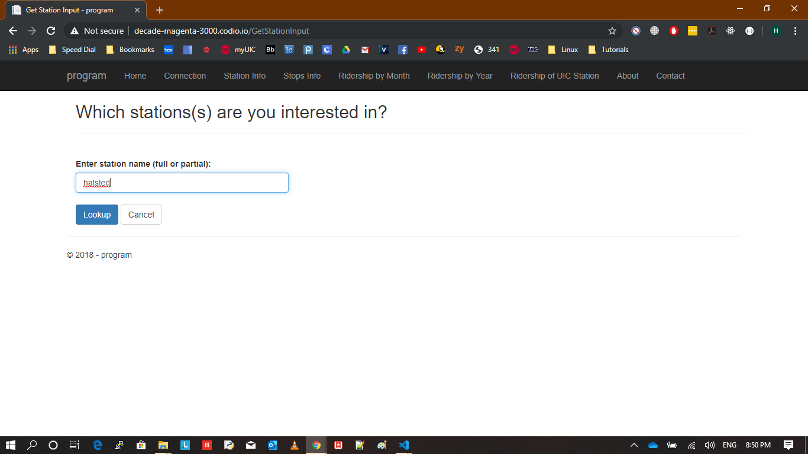
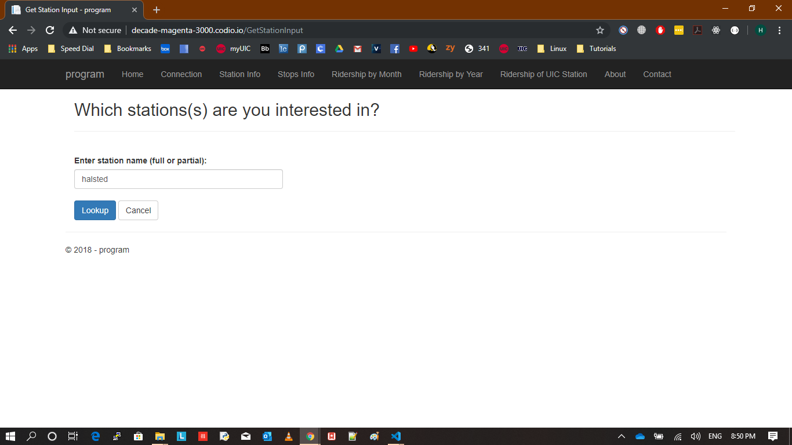
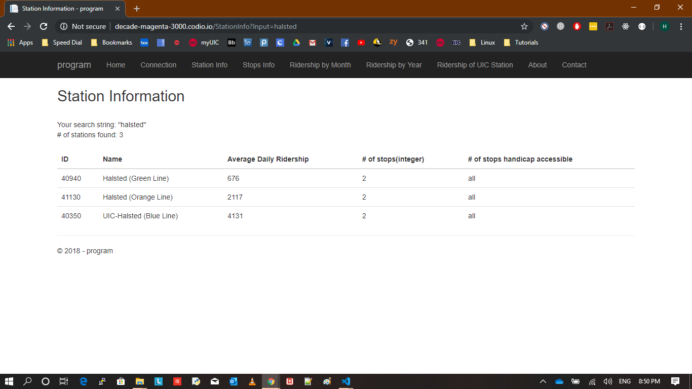
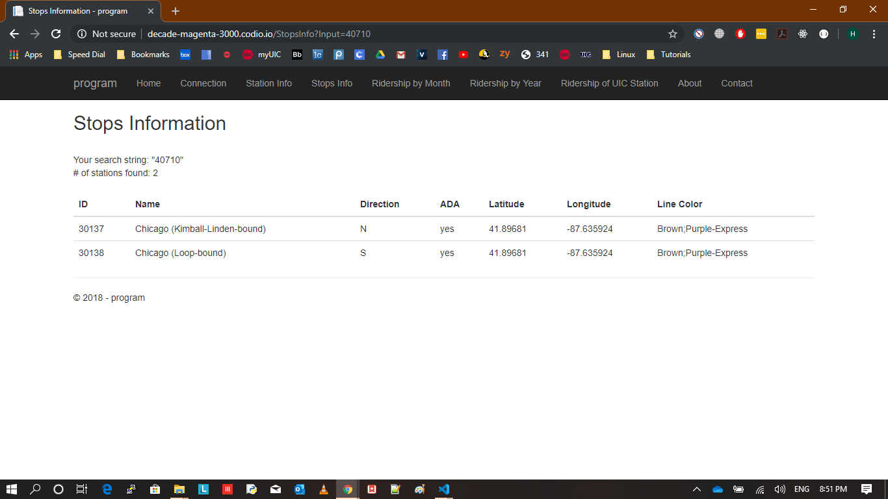
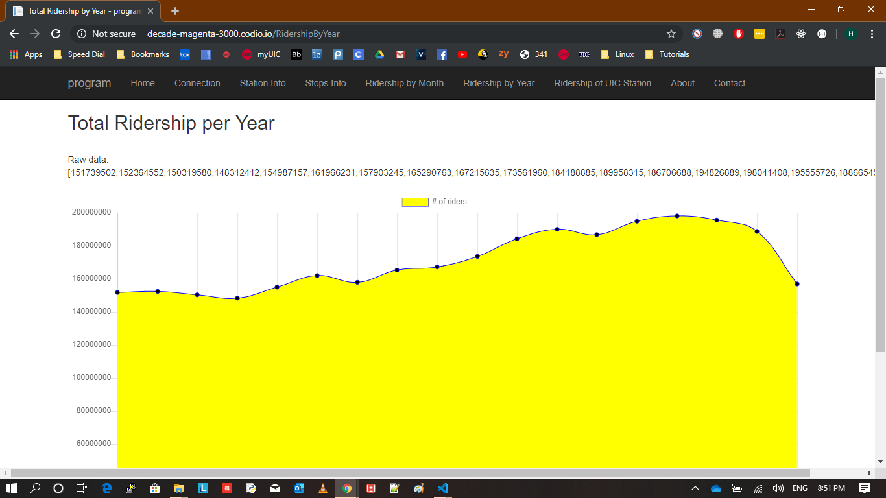
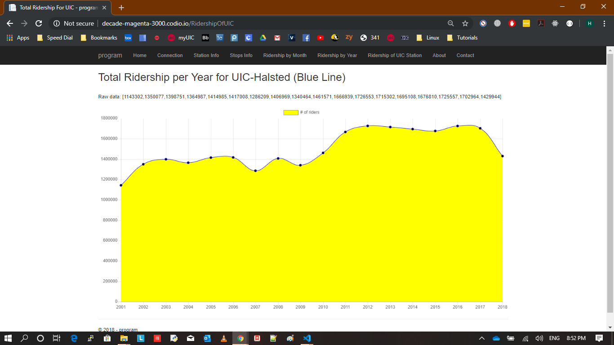
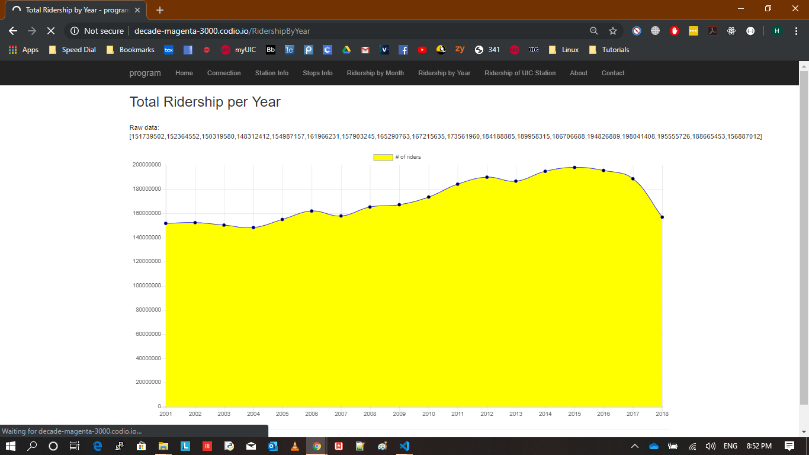
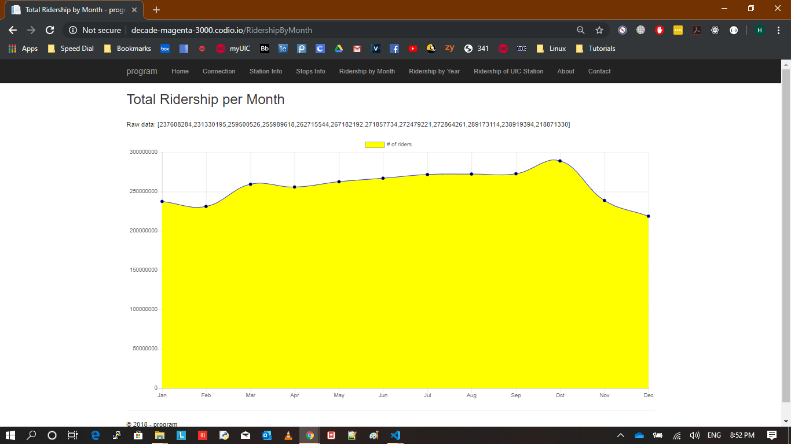

# CTA_Analysis_App
### The app is based on the MVC design pattern, using ASP.NET, C# and ADO.NET
#### A web app that retrieves information about CTA L stations and stops.

Here are some screenshots of the app:

